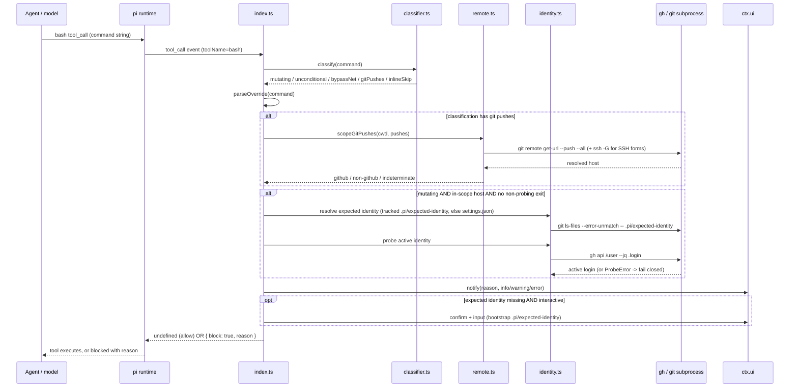
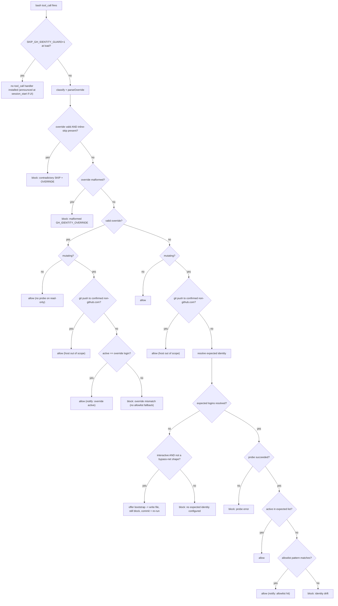
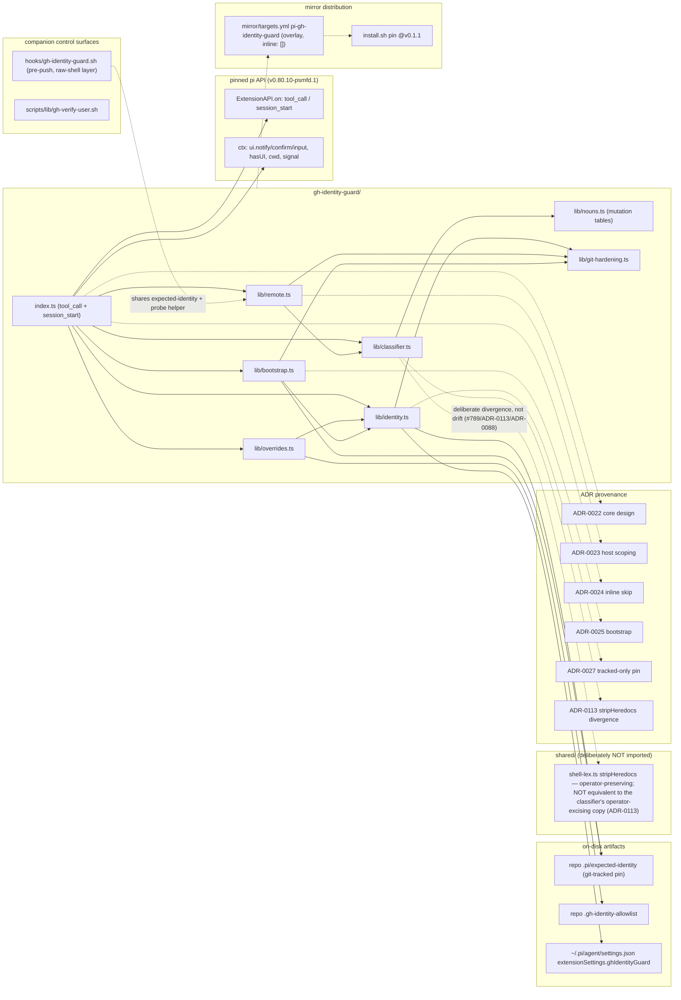

# gh-identity-guard

Pi extension that intercepts mutating GitHub invocations from the `bash`
tool, verifies the active `gh` CLI identity matches an expected identity
declared per-repo, and blocks on drift. Fail-closed at the tool boundary.

Source ADRs: [`adrs/0022-gh-identity-guard-extension.md`](https://github.com/psmfd/pi-config/blob/main/adrs/0022-gh-identity-guard-extension.md), [`adrs/0027-gh-identity-guard-tracked-expected-identity.md`](https://github.com/psmfd/pi-config/blob/main/adrs/0027-gh-identity-guard-tracked-expected-identity.md).

## Install

```sh
pi install git:github.com/psmfd/pi-gh-identity-guard
```

Try it first without installing: `pi -e git:github.com/psmfd/pi-gh-identity-guard`.

## Why this exists

`gh auth status` reads a config-file flag (`active`) that can disagree with
the token actually used by `gh api` after a `gh auth switch` + refresh. The
only authoritative answer to "who am I as?" is `gh api /user --jq .login`.
Defect filed as #217,
procedurally patched in #251
(skill text + sourceable helper); this extension is the structural fix.

## What it blocks

A `bash` tool call is gated when the command classifies as a mutating
GitHub operation (full table in ADR-0022 § Q2):

- `gh <noun> <verb>` for any noun/verb pair in the mutation table
  (`pr create|merge|close|...`, `issue create|edit|...`, `release create|...`,
  `repo create|delete|fork|...`, `secret set`, `variable set`, `workflow run`,
  `auth switch|login|...`, etc.)
- `gh api -X POST|PATCH|PUT|DELETE` (and `--method`, `-XPOST`, `--method=...` forms)
- `gh api` with `-f|--field|-F|--raw-field|--input` (these implicitly switch to POST)
- `git push` in any form (`--force`, `--delete`, `+refspec`, `--mirror`, etc.)
  **whose effective remote is `github.com`**. A push to a non-`github.com`
  remote (Azure DevOps, GitLab, Bitbucket, self-hosted) carries no
  wrong-`gh`-account risk and passes through unchecked — matching the
  companion pre-push hook's scope. The host is resolved at the tool boundary
  (`git remote get-url --push --all`, applying `insteadOf`/`pushInsteadOf`
  rewrites; SSH host-aliases resolved via `ssh -G`) and the resolution
  **fails closed**: a push whose host is `github.com` *or* cannot be
  positively determined as non-`github.com` is gated. See ADR-0023.
- Compound shapes that mention `gh`/`git push` (`bash -c '...'`, `eval`,
  `xargs gh|git`, `$(...)`, backticks) — these **force identity verification**
  rather than outright denying, so legitimate scripts that wrap `gh` calls
  still work as long as the active identity is correct. (Because the effective
  remote of a push hidden inside these shapes can't be resolved, they gate
  unconditionally — host-scoping does not apply.)

Read-only invocations (`gh pr list`, `gh api repos/foo/bar`, `git pull`,
`gh issue view`, etc.) are not classified as mutating and pass through
unchecked.

### Runtime flow

The `tool_call` lifecycle — classification, override parse, host resolution,
the identity probe, and the notify/bootstrap surfaces:



The full gate ladder — load-time skip, override precedence, classification,
host-scoping, the bootstrap branch, and the allowlist:



## Declaring the expected identity

Precedence (first match wins):

1. **Git-tracked `./.pi/expected-identity` at the repo root** — one GitHub
   login per line (multiple lines allowed for repos that legitimately accept
   either a bot or a human maintainer). `#` line comments and blanks are
   ignored. This file must be tracked by Git (`git ls-files --error-unmatch --
   .pi/expected-identity`); it is itself the code-review artifact for who may
   write to this repo via pi. If the file exists but is untracked, the guard
   emits a `warning` notify, ignores the local-only policy, and falls through
   to the user-layer fallback below. If the tracked file exists but every line
   is blank, commented, or an invalid login (e.g. a typo), the guard emits a
   `warning` notify and falls through to the user-layer fallback below rather
   than silently demoting the file.

2. **`extensionSettings.ghIdentityGuard.expectedIdentity` in
   `~/.pi/agent/settings.json`** — user-layer fallback. Accepts a single
   string or an array of strings:

   ```json
   {
     "extensionSettings": {
       "ghIdentityGuard": {
         "expectedIdentity": "TheSemicolon"
       }
     }
   }
   ```

3. **Neither set → fail-closed.** The extension does not assume
   `gh api /user` is correct just because there is no comparison target.
   First mutation surfaces an actionable error pointing here.

### Interactive bootstrap (ADR-0025)

When neither source is configured, the fail-closed state additionally offers
to **create `<repo>/.pi/expected-identity` in place** — but only in an
interactive session (`ctx.hasUI`: TUI or RPC) and only on a clean mutating
call (never a bypass-DENY-net shape). On a `-p`/JSON run, or a
shell-interpreter/`eval`/`xargs`/`$(…)` shape, it stays a plain fail-closed
block.

The prompt:

- shows the active `gh api /user` login and the `origin` owner, and offers a
  **suggested** login only when they match **and** the repo is not a personal
  fork (`gh repo view --json parent`). The suggestion is reference-only — the
  operator **re-types** the login (no pre-filled, one-keystroke accept);
- validates the entered login (≤39 chars, GitHub-username shape incl. the EMU
  `_<shortcode>` suffix) before writing; an invalid entry writes nothing;
- writes the per-repo file atomically (the user-layer `settings.json` is
  **never** written), then **still blocks this call** so the operator runs
  `git add .pi/expected-identity`, commits the new trust anchor, and re-runs
  (the re-run does the real identity check). Until Git tracks the file, the
  tracked-only read gate from [ADR-0027](https://github.com/psmfd/pi-config/blob/main/adrs/0027-gh-identity-guard-tracked-expected-identity.md)
  ignores it as local-only policy. The block reason is distinct from the
  unconfigured-state text so the model does not loop re-issuing the call.

No dialog carries a `timeout` (an RPC timed dialog auto-resolves silently);
a cancelled/declined prompt maps to the standard fail-closed block. The
companion pre-push hook implements the same flow against `/dev/tty`. Both
halves now require the per-repo pin to be Git-tracked before trusting it
([ADR-0027](https://github.com/psmfd/pi-config/blob/main/adrs/0027-gh-identity-guard-tracked-expected-identity.md)).

**Project-layer `./.pi/settings.json` is NOT consulted.** Per
[ADR-0019](https://github.com/psmfd/pi-config/blob/main/adrs/0019-compaction-optimizer-extension.md) the project
settings layer is treated as untrusted input; a hostile project setting
`ghIdentityGuard.expectedIdentity: attacker-login` would silently spoof the
guard on `cd` into a malicious repo. The per-repo `.pi/expected-identity`
file is the right surface for project-scoped identity because changing it
requires a PR once Git tracks the path.

## Overrides

These surfaces **announce themselves via `ctx.ui.notify`** on use — silent
overrides are not supported.

> **`SKIP_GH_IDENTITY_GUARD` (either form) and `.gh-identity-allowlist` are
> OPERATOR controls, not agent actions.** They *disable* the guard rather than
> assert the right identity. When the agent hits an identity block, the
> correct response is to use the right account — `gh auth switch` or
> `GH_IDENTITY_OVERRIDE=<login>` (which still verifies identity), §3. Disabling
> the guard is a deliberate decision a human makes after reviewing the session;
> it is never the way to clear a block encountered mid-task.

### 1. `SKIP_GH_IDENTITY_GUARD=1` — disable (operator)

**Session-wide:**

```sh
SKIP_GH_IDENTITY_GUARD=1 pi
```

Extension loads but installs no `tool_call` handler. Announced once at
session start with the active identity for auditability — **in an
interactive (UI) session only**. In a headless/no-UI run (`pi -p`) the
`ctx.ui.notify` is suppressed by the `ctx.hasUI` guard, so the session-wide
bypass is not announced; it remains visible in shell history and in the
launching command. Accepted gap, parallel to the per-command headless-skip
gap in Operator notes. So "silent overrides are not supported" holds for
interactive sessions; headless is the documented exception.

**Per-command** (inline prefix on a single mutating call):

```sh
SKIP_GH_IDENTITY_GUARD=1 git push origin main
```

Honored **per-segment** — only when the prefix leads the *same* simple command
as the mutation (matching what the shell actually delivers to the process). So
`SKIP_GH_IDENTITY_GUARD=1 true && git push` does **not** skip the push, and in
a compound `SKIP_GH_IDENTITY_GUARD=1 git push a && git push b` only the first
push is exempt. The value must be exactly `1`. It is **ignored** for
`bash -c`/`eval`/`$(...)` shapes (those always gate via the bypass-DENY net),
and combining it with `GH_IDENTITY_OVERRIDE=` in the same call is rejected as
contradictory. Each honored skip emits an `OPERATOR SKIP` warning notify. See
[ADR-0024](https://github.com/psmfd/pi-config/blob/main/adrs/0024-gh-identity-guard-inline-skip.md).

### 2. `.gh-identity-allowlist` — per-pattern, per-repo

One pattern per line at the repo root; `#` comments; blanks ignored.
**MVP semantic: exact substring match** against the bash command string.
Glob/regex support deferred to a future revision. Each hit emits a notify
naming the matched pattern and both identities.

```text
# .gh-identity-allowlist — repos that accept bot comments from human accounts
gh pr comment
gh issue comment
```

### 3. `GH_IDENTITY_OVERRIDE=<login>` — per-invocation prefix

```sh
GH_IDENTITY_OVERRIDE=bot-foo gh pr comment 42 --body "scheduled note"
```

**Changes** the expected identity for this one call. Does **not** skip the
identity check. The active gh identity must equal `<login>` or the call
hard-blocks. The override **does not fall through** to the allowlist on
mismatch — a failed assertion blocks unconditionally.

Semantics worth calling out:

- **No probe on read-only commands.** A non-mutating command carries no
  wrong-account-mutation risk, so an override prefix on one (e.g.
  `GH_IDENTITY_OVERRIDE=bot-foo gh pr list`) is allowed without a probe or
  identity assertion — consistent with the standard path, which never probes
  a read-only call. The assertion only runs when the command would mutate.
  (Shell-interpreter / `eval` / command-substitution shapes still classify
  as mutating via the bypass-DENY net, so they are always verified.)
- **Works with no expected identity configured.** Because the override
  *declares its own* expected identity for the call, it deliberately
  bypasses the "no `.pi/expected-identity` → fail-closed" floor. That floor
  exists to block an *unspecified* identity; the override *specifies* one,
  so a mutating `GH_IDENTITY_OVERRIDE=<login>` call succeeds (when the active
  identity equals `<login>`) even in a repo with no expected-identity file.

Parser specifics:

- Recognized only at the *outer* level of the command — accepts leading
  whitespace and multiple POSIX-style `NAME=value` assignments before the
  command word (`GH_DEBUG=1 GH_IDENTITY_OVERRIDE=bot-foo gh ...`).
- **Not recognized** inside `bash -c '...'`, `eval '...'`, heredoc bodies,
  or quoted strings (those shapes route through the bypass-DENY net
  instead and do not honor the override).
- Duplicate `GH_IDENTITY_OVERRIDE=` keys in the leading run are rejected
  as ambiguous (shell-legal, operator-confusing).
- `<login>` must match the GitHub username regex
  (`^[a-zA-Z0-9](?:[a-zA-Z0-9]|-(?=[a-zA-Z0-9])){0,38}(?:_[a-zA-Z0-9]{3,8})?$`);
  the optional `_<shortcode>` suffix accepts Enterprise Managed Users (EMU)
  logins such as `Example-User_acme` (per [docs.github.com EMU username
  considerations][emu-docs]). Total length is capped at 39 chars by a
  separate precheck. Validated before the probe to neutralize
  prompt-injected newlines/ANSI in downstream notify text.

[emu-docs]: https://docs.github.com/en/enterprise-cloud@latest/admin/managing-iam/iam-configuration-reference/username-considerations-for-external-authentication

## Threat model — what this guard does and does not claim

In-scope (mitigated): silent-drift wrong-author writes after `gh auth
switch` in another shell; mixed-identity sessions; operator footgun on
"push the fix" with the wrong active account; cross-repo identity
confusion in multi-repo workflows.

**Out-of-scope** (full enumeration in
[ADR-0022 § Threat Model](https://github.com/psmfd/pi-config/blob/main/adrs/0022-gh-identity-guard-extension.md#threat-model-and-security-posture)):

- Compromised local `gh` token (this is an authentication-state guard, not
  a token-integrity guard).
- Raw shell outside pi — **partially addressed** by the companion git
  pre-push hook ([`hooks/gh-identity-guard.sh`](https://github.com/psmfd/pi-config/blob/main/hooks/gh-identity-guard.sh),
  landed via #260 and
  #257). The hook
  fires on `git push` from any shell (pi, plain terminal, IDE) for GitHub
  remotes only; ADO/GitLab/Bitbucket/self-hosted pushes pass through. Both
  layers share the same expected-identity resolution chain and the
  [`scripts/lib/gh-verify-user.sh`](https://github.com/psmfd/pi-config/blob/main/scripts/lib/gh-verify-user.sh)
  probe helper. Install via `INSTALL_GIT_HOOKS=1 ./setup.sh`. Raw `gh`
  invocations from outside pi remain out of scope (no equivalent boundary).
- `git push` over SSH remotes — authenticity is decided by the ssh-agent
  key, not the active gh identity. The guard still verifies the expected
  gh identity in that case; documented behavioral choice.
- **GitHub Enterprise Server (GHES)** remotes — GHES uses operator-defined
  hostnames (`github.mycompany.com`), so host-scoping (exact `github.com`)
  does not gate them. `gh` keys identity per-host and the probe targets
  `github.com`; per-host GHES identity verification is out of scope (ADR-0023
  accepted gap).
- **IDN / homograph hosts and `GIT_CONFIG_*`-env rewrites** — a Unicode
  look-alike host is not normalised, and a `pushInsteadOf` rewrite injected
  via `GIT_CONFIG_GLOBAL`/`GIT_CONFIG_COUNT` env vars that repoints a
  github.com remote *away* from github.com is an integrity concern downstream
  of the guard, not a wrong-identity bypass (ADR-0023). An inline
  `-c …insteadOf=` on the push command itself is detected and fails closed.
- Subagent shells that don't load the extension. Mitigation: the extension
  is **auto-discovered and loaded for every session** (global
  `~/.pi/agent/extensions/`), so a subagent inherits it just like the parent;
  the git pre-push hook is the backstop for any `git push` path the
  in-session layer cannot see. There is **no** per-wrapper `validate.sh` gate
  today — whether one adds real defense-in-depth (extensions are not
  excludable per-wrapper) is tracked in
  #802.
- Raw `curl -X POST -H "Authorization: bearer $(gh auth token)" api.github.com/...`
  (token-extraction bypass; Phase-2 classifier extension if real-world
  pressure justifies it).
- `GIT_AUTHOR_NAME` / `GIT_AUTHOR_EMAIL` mismatches (this is a gh CLI
  identity guard, not a git commit-author guard).
- TOCTOU between probe and execution (~tens of ms; bounded but not zero).
- The override env var itself if set in `~/.zshrc` (announce-at-init
  notify mitigates).
- **Adversarial classifier obfuscation** — `$IFS`-substitution word-splitting,
  glued command-substitution (`g$()h`), and pipe-into-decode payloads that
  reconstruct a `gh`/`git push` verb only at runtime (ADR-0022 § Q2). The
  classifier reads the raw command string and does not runtime-expand it; the
  bypass-DENY net catches the common `bash -c`/`eval`/`$(…)` shapes by forcing
  verification, but arbitrary obfuscation is out of scope by the same
  undecidability argument as `bash-destructive-guard` (ADR-0072). This is a
  naive-misuse guard, not an adversary-resistant sandbox.

## Composition with other bash guards

Loaded alongside `secrets-guard` and `bash-destructive-guard`. All three
are deny-only and ordering-independent; the **cross-extension** firing order
of `tool_call` handlers remains unspecified as of the pinned pi runtime
(v0.80.10-psmfd.1) — its `docs/extensions.md` lifecycle documents that
`tool_call` fires and can block, but not which registered extension's handler
runs first when several are loaded. Worst case is a redundant block by the
second-firing guard. Each guard names itself in its `reason:` text so
operators can identify which one fired.

## Operator notes

- Probe latency is ~80–150ms per mutating call. No cross-call cache (any
  TTL window reintroduces the originating defect class). Acceptable given
  mutations are not high-frequency.
- The probe has a **10s timeout**. A hung `gh api /user` (captive portal,
  slowloris, network stall) is killed and surfaces as `exec-failed` →
  fail-closed block, rather than hanging the tool call indefinitely. The
  sourceable helper applies the same cap (`timeout`/`gtimeout`, else a
  bash watchdog).
- Notify levels: `warning` for a session-wide bypass and for a per-command
  `OPERATOR SKIP`; `error` for blocks (including a contradictory
  SKIP+OVERRIDE call); `info` for allowlist hits and per-invocation override
  success. A per-command skip in a headless (no-UI) session is honored but
  cannot be announced — accepted gap (the prefix is visible in the tool-call
  stream).
- For non-pi consumers (git hooks, CI, ad-hoc shell), use the sourceable
  helper `scripts/lib/gh-verify-user.sh` (`gh_verify_user <login>`) — same
  probe logic, no pi dependency.
- Every git subprocess this extension spawns (remote resolution, tracked-file
  check, interactive bootstrap) is hardened with
  `-c core.fsmonitor= -c core.hooksPath=/dev/null`, so a hostile repo's local
  config cannot execute code when the guard merely resolves a remote
  (CVE-2026-45033 class; security-review #265). The flags live in one place,
  `lib/git-hardening.ts`.

## Companion control surfaces

- **Procedural skill text** in `agent/skills/gh-cli-expert/SKILL.md`
  § Authentication → Identity drift and
  `agent/skills/work-item-management-expert/SKILL.md` § Identity pre-flight.
  Belt-and-suspenders documentation of *why* the guard exists, surviving
  the extension as a fallback for sessions where the extension is disabled.
- **Helper script** `scripts/lib/gh-verify-user.sh` for non-pi consumers.
- **Companion git pre-push hook** ([`hooks/gh-identity-guard.sh`](https://github.com/psmfd/pi-config/blob/main/hooks/gh-identity-guard.sh),
  shipped via #260 /
  #257) closes the
  raw-shell-outside-pi `git push` gap. Install via `INSTALL_GIT_HOOKS=1 ./setup.sh`.

## Architecture

Module structure, the pinned pi API surface, on-disk artifacts, the companion
control surfaces, and the distribution path:



## References

- ADR-0022 — design decisions
- ADR-0023 — remote-host scoping of the in-session `git push` classification (#265)
- ADR-0024 — per-command inline skip + override-hint hardening (#276)
- ADR-0025 — interactive bootstrap of `.pi/expected-identity` (#294)
- ADR-0027 — tracked-only `.pi/expected-identity` read gate (#306)
- ADR-0113 — why the classifier keeps its own `stripHeredocs` (divergence from `shared/shell-lex.ts`; #789)
- #217 / #251 — original defect + procedural fix
- #252 — this implementation
- #265 — in-session layer over-blocked non-github.com (e.g. Azure DevOps) pushes
- #276 — per-command inline `SKIP_GH_IDENTITY_GUARD=1` + override-hint hardening
- #257 — companion git pre-push hook
- #258 — backport announce-bypass to `secrets-guard` (follow-up)
- `agent/extensions/secrets-guard/` — fail-closed tool-boundary precedent
- `agent/extensions/bash-destructive-guard/` — bash-classifier precedent
